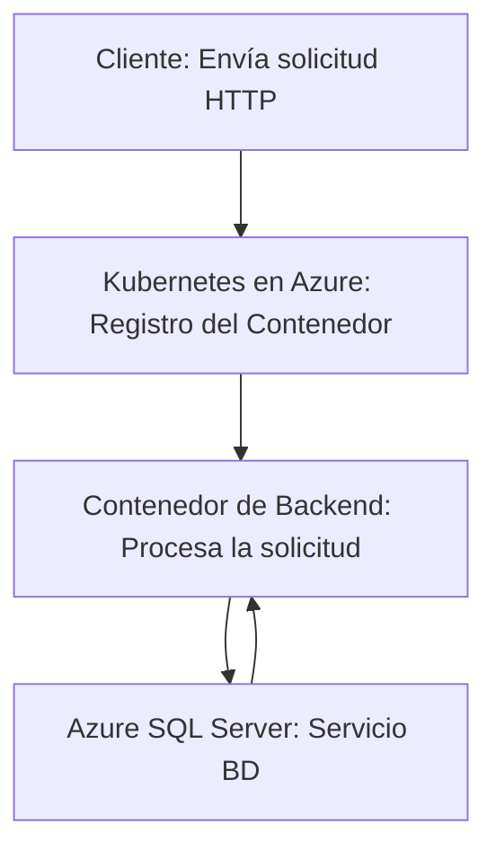

# Flujo de Transacción en Azure

## Diagrama del Proceso

```mermaid
flowchart TD
    A[Cliente: Envía solicitud HTTP]
    B[Kubernetes en Azure: Registro del Contenedor]
    C[Contenedor de Backend: Procesa la solicitud]
    D[Azure SQL Server: Servicio BD]

    A --> B
    B --> C
    C --> D
    D --> C
```

<!-- ...inserta más detalles o pasos según sea necesario... -->
