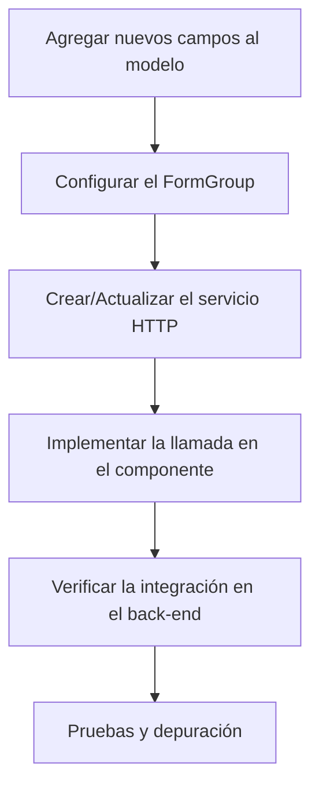

# Proceso de Transacción HTTP (Visual)

// ...existing introduction...
## Diagrama del Proceso



# Guía para realizar una transacción HTTP con nuevos campos

## 1. Agregar los nuevos campos al modelo
- Verifica que el modelo que representa al usuario (o la entidad correspondiente) incluya todos los nuevos campos.
- Crea una interfaz o clase (por ejemplo, `User`) que contenga los campos adicionales.

## 2. Configurar el FormGroup en el componente
- Asegúrate de que el `FormGroup` en el componente (por ejemplo, en `profile.component.ts`) incluya controles para los nuevos campos.
- Si es necesario, actualiza la inicialización del formulario para cubrir los nuevos campos.

## 3. Crear/Actualizar el servicio HTTP
- Inyecta `HttpClient` en el servicio que realizará la transacción.
- Crea un método para enviar los datos mediante un método POST (u otro que se requiera) a la API.
- Prepara el objeto de datos que incluya tanto los campos existentes como los nuevos.

Ejemplo:
```typescript
// ...existing code...
createUser(userData: User): Observable<any> {
  return this.http.post('https://api.tuservidor.com/users', userData);
}
// ...existing code...
```

## 4. Implementar la llamada en el componente
- En el método donde se procesa el formulario (por ejemplo, `updateMother()`), llama al método del servicio HTTP y pasa el objeto con los nuevos campos.
- Maneja la respuesta y los posibles errores, por ejemplo, utilizando `subscribe`.

Ejemplo:
```typescript
// ...existing code...
this.userService.createUser(this.profileForm.value)
  .subscribe({
    next: (response) => {
      // ...procesamiento de respuesta exitosa...
    },
    error: (err) => {
      // ...gestión de errores...
    }
  });
// ...existing code...
```

## 5. Verificar la integración en el back-end
- Confirma que el back-end esté preparado para recibir y procesar los nuevos campos.
- Ajusta la validación y el mapeo en el servidor si es necesario.

## 6. Pruebas y depuración
- Ejecuta pruebas para asegurar que la transacción HTTP envía todos los datos correctamente.
- Utiliza herramientas del navegador (como la pestaña Network de las DevTools) para verificar la solicitud y la respuesta.
- Realiza ajustes basados en la retroalimentación obtenida.

¡Sigue estos pasos para integrar la transacción HTTP con éxito usando los nuevos campos!